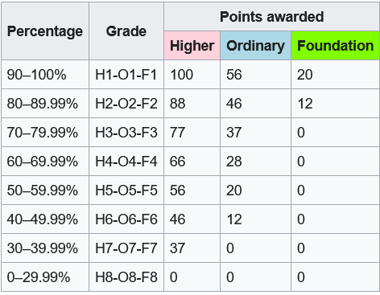

# Leaving-Certificate
Breakdown of candidates by grade awarded in each subject from 2017 to 2020 in the Leaving Certificate in Ireland

The Leaving Certificate Examination, commonly referred to as the Leaving Cert, is the final exam of the Irish secondary school system and the university matriculation examination in Ireland.(source: https://en.wikipedia.org/wiki/Leaving_Certificate_(Ireland))

## Grading

## Libraries
import pandas as pd\
import matplotlib.pyplot as plt\
import seaborn as sns
